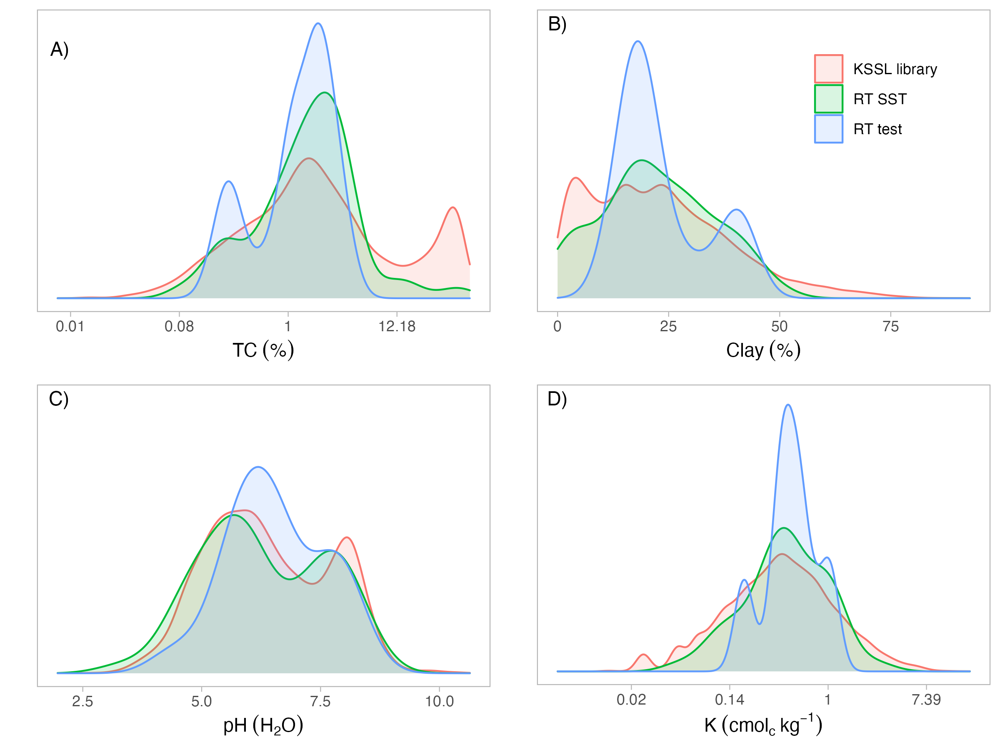
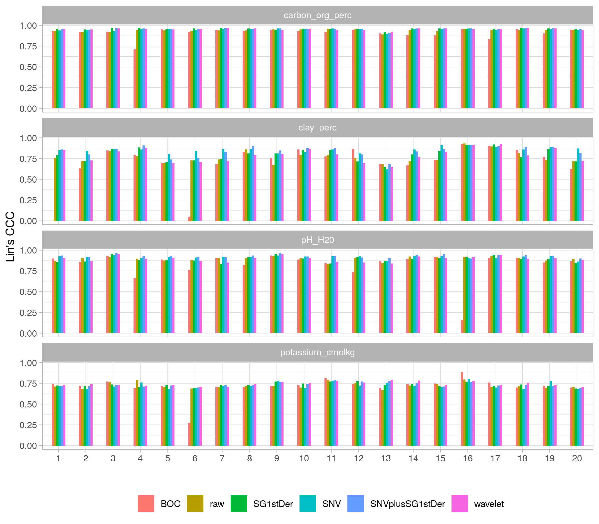

  
```{r setup, include=FALSE}
library("tidyverse")
mnt.dir <- "~/projects/mnt-ringtrial/"
```

## Overview

Inter-laboratory comparison of soil spectral measurements as part of the SoilSpec4GG project.

This repository is used for assessing the prediction performance on different instruments of the ring trial.

The datasets were prepared to a target format in [soilspectroscopy/ringtrial-prep](https://github.com/soilspectroscopy/ringtrial-prep).

In addition, an exploratory data analysis of the spectral variations is provided in [soilspectroscopy/ringtrial-eda](https://github.com/soilspectroscopy/ringtrial-eda).

The workspace development is defined by:

- GitHub repository: [soilspectroscopy/ringtrial-modeling](https://github.com/soilspectroscopy/ringtrial-modelingmodeling).
- Google Cloud storage for efficient file storage and access: [whrc.org/soilcarbon-soilspec/storage/sc-ringtrial](https://console.cloud.google.com/storage/browser/sc-ringtrial).

## Modeling framework

Internal performance is evaluated using 10-fold cross-validation repeated 10-times for each instrument with fine-tuned PLSR.

For calibration transfer analysis, 20 samples held out from the spectral subspace transform (SST) are used as test set to keep the same base of comparison for any combination. With this, different preprocessing and model types are evaluated with a subset of the KSSL with 15,000 samples.

- Preprocessing: `raw`, `BOC`, `SG1stDer`, `SNV`, `SNVplusSG1stDer`, `wavelet`, `SST.`  
- Model types: `PLSR`, `MBL`, and `Cubist`[^1].  
- Soil properties: `TC`, `clay`, `pH`, `K`[^2].  
- Performance metrics: `RMSE`, `bias`, `RPIQ`, `Rsq`, `Lin's CCC`.

[^1]: For Cubist, PCA compression is performed before model fitting using `cumvar= 99.99%` on the reference space (KSSL subset) with all the RT instruments projected onto it.  
[^2]: Soil properties are `log` transformed if `-3 < skewness or kurtosis > 3`. Check descriptive statistics for a summary. In addition, the performance metrics are reported on log space for those cases.  

Statistical analysis is performed on `RMSE` values using non-parametric `Kruskal-Wallis` test for comparing preprocessing and model types at a significance level of 95%. While the statistical tests are performed on the RMSE values, Lin's CCC is displayed for the sake of visualization as it both encompasses accuracy and bias trend.

## Descriptive statistics

Original scale:  
```{r beforeLog, echo=F, message=F, warning=F}
read_csv("outputs/RT_wetchem_summary_beforeLog.csv") %>%
  filter(source == "ALL") %>%
  select(-source) %>%
  knitr::kable(digits = 2)
```

After natural-log transformation:  
```{r afterLog, echo=F, message=F, warning=F}
read_csv("outputs/RT_wetchem_summary_afterLog.csv") %>%
  filter(source == "ALL") %>%
  select(-source) %>%
  knitr::kable(digits = 2)
```

TOC and K are displayed in log scale but with x-axis labels in original unit:  
  

## Internal 10-fold Cross-validation

Tabular information is provided at `outputs/tab_int10CVrep10_performance_metrics.csv`.



## Calibration transfer
