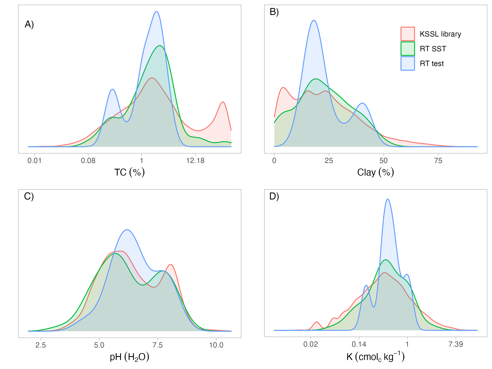
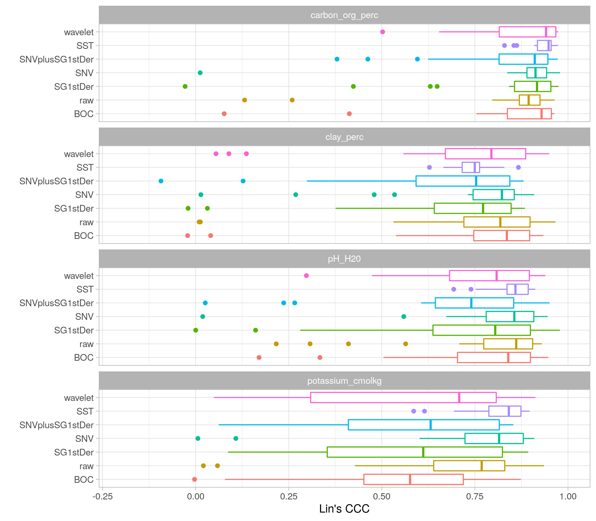

Soil spectroscopy ring trial
================

-   [Overview](#overview)
-   [Modeling framework](#modeling-framework)
-   [Descriptive statistics](#descriptive-statistics)
-   [Internal 10-fold
    Cross-validation](#internal-10-fold-cross-validation)
-   [Calibration transfer](#calibration-transfer)
    -   [PLSR](#plsr)
    -   [MBL](#mbl)
    -   [Cubist](#cubist)

## Overview

Inter-laboratory comparison of soil spectral measurements as part of the
SoilSpec4GG project.

This repository is used for assessing the prediction performance on
different instruments of the ring trial.

The datasets were prepared to a target format in
[soilspectroscopy/ringtrial-prep](https://github.com/soilspectroscopy/ringtrial-prep).

In addition, an exploratory data analysis of the spectral variations is
provided in
[soilspectroscopy/ringtrial-eda](https://github.com/soilspectroscopy/ringtrial-eda).

The workspace development is defined by:

-   GitHub repository:
    [soilspectroscopy/ringtrial-modeling](https://github.com/soilspectroscopy/ringtrial-modelingmodeling).
-   Google Cloud storage for efficient file storage and access:
    [whrc.org/soilcarbon-soilspec/storage/sc-ringtrial](https://console.cloud.google.com/storage/browser/sc-ringtrial).

## Modeling framework

Internal performance is evaluated using 10-fold cross-validation
repeated 10-times for each instrument with fine-tuned PLSR.

For calibration transfer analysis, 20 samples held out from the spectral
subspace transform (SST) are used as test set to keep the same base of
comparison for any combination. With this, different preprocessing and
model types are evaluated with a subset of the KSSL with 15,000 samples.

-   Preprocessing: `raw`, `BOC`, `SG1stDer`, `SNV`, `SNVplusSG1stDer`,
    `wavelet`, `SST.`  
-   Model types: `PLSR`, `MBL`, and `Cubist`[^1].  
-   Soil properties: `TC`, `clay`, `pH`, `K`[^2].  
-   Performance metrics: `RMSE`, `bias`, `RPIQ`, `Rsq`, `Lin's CCC`.

Statistical analysis is performed on `RMSE` values using non-parametric
permutation test for comparing experimental factors at a significance
level of 95%. While the statistical tests are performed on the RMSE
values, Lin’s CCC is displayed better visualization reference as it both
encompasses accuracy and bias trend into a scaled parameter.

## Descriptive statistics

Original scale:

| soil_property    |   n |  min |  mean |    sd | median |   iqr |   max | skewness | kurtosis |
|:-----------------|----:|-----:|------:|------:|-------:|------:|------:|---------:|---------:|
| carbon_tot_perc  |  69 | 0.09 |  2.76 |  6.13 |   1.81 |  2.03 | 49.10 |     6.57 |    49.08 |
| clay_perc        |  69 | 0.00 | 22.61 | 11.80 |  21.09 | 14.40 | 49.30 |     0.21 |     2.40 |
| pH_H20           |  70 | 3.35 |  6.37 |  1.22 |   6.09 |  1.93 |  8.57 |    -0.05 |     2.14 |
| potassium_cmolkg |  69 | 0.05 |  0.56 |  0.44 |   0.43 |  0.51 |  2.84 |     2.33 |    11.58 |

After natural-log transformation:

| soil_property    |   n |   min |  mean |   sd | median |  iqr |  max | skewness | kurtosis |
|:-----------------|----:|------:|------:|-----:|-------:|-----:|-----:|---------:|---------:|
| carbon_tot_perc  |  69 | -2.39 |  0.33 | 1.11 |   0.59 | 1.24 | 3.89 |     0.01 |     3.90 |
| potassium_cmolkg |  69 | -3.05 | -0.84 | 0.77 |  -0.84 | 1.02 | 1.04 |    -0.37 |     3.23 |

TOC and K are displayed in log scale but with x-axis labels in original
unit:  

## Internal 10-fold Cross-validation

Tabular information is provided at
`outputs/tab_int10CVrep10_performance_metrics.csv`.

## Calibration transfer

### PLSR

Calibration performance

| soil_property    | prep_transform   | prep_spectra    | comps |     n | rmse | bias |  rsq |  ccc |  rpd | rpiq |
|:-----------------|:-----------------|:----------------|------:|------:|-----:|-----:|-----:|-----:|-----:|-----:|
| carbon_org_perc  | logTransform     | BOC             |    30 | 14969 | 0.43 |    0 | 0.95 | 0.97 | 4.39 | 5.87 |
| carbon_org_perc  | logTransform     | raw             |    30 | 14969 | 0.43 |    0 | 0.95 | 0.97 | 4.40 | 5.88 |
| carbon_org_perc  | logTransform     | SG1stDer        |    30 | 14969 | 0.41 |    0 | 0.95 | 0.98 | 4.69 | 6.27 |
| carbon_org_perc  | logTransform     | SNV             |    30 | 14969 | 0.43 |    0 | 0.95 | 0.97 | 4.43 | 5.93 |
| carbon_org_perc  | logTransform     | SNVplusSG1stDer |    30 | 14969 | 0.41 |    0 | 0.95 | 0.98 | 4.70 | 6.29 |
| carbon_org_perc  | logTransform     | SST             |    30 | 14969 | 0.43 |    0 | 0.95 | 0.97 | 4.43 | 5.93 |
| carbon_org_perc  | logTransform     | wavelet         |    30 | 14969 | 0.41 |    0 | 0.95 | 0.98 | 4.63 | 6.20 |
| clay_perc        | withoutTransform | BOC             |    30 | 14888 | 5.92 |    0 | 0.86 | 0.92 | 2.64 | 3.75 |
| clay_perc        | withoutTransform | raw             |    30 | 14888 | 5.85 |    0 | 0.86 | 0.92 | 2.67 | 3.79 |
| clay_perc        | withoutTransform | SG1stDer        |    30 | 14888 | 5.34 |    0 | 0.88 | 0.94 | 2.93 | 4.15 |
| clay_perc        | withoutTransform | SNV             |    30 | 14888 | 5.99 |    0 | 0.85 | 0.92 | 2.61 | 3.70 |
| clay_perc        | withoutTransform | SNVplusSG1stDer |    30 | 14888 | 5.45 |    0 | 0.88 | 0.94 | 2.87 | 4.07 |
| clay_perc        | withoutTransform | SST             |    30 | 14888 | 5.99 |    0 | 0.85 | 0.92 | 2.61 | 3.70 |
| clay_perc        | withoutTransform | wavelet         |    30 | 14888 | 5.39 |    0 | 0.88 | 0.94 | 2.90 | 4.12 |
| pH_H20           | withoutTransform | BOC             |    30 | 15000 | 0.56 |    0 | 0.81 | 0.90 | 2.30 | 3.80 |
| pH_H20           | withoutTransform | raw             |    30 | 15000 | 0.57 |    0 | 0.81 | 0.89 | 2.28 | 3.77 |
| pH_H20           | withoutTransform | SG1stDer        |    30 | 15000 | 0.52 |    0 | 0.84 | 0.91 | 2.51 | 4.15 |
| pH_H20           | withoutTransform | SNV             |    30 | 15000 | 0.56 |    0 | 0.81 | 0.90 | 2.30 | 3.81 |
| pH_H20           | withoutTransform | SNVplusSG1stDer |    30 | 15000 | 0.52 |    0 | 0.84 | 0.91 | 2.49 | 4.11 |
| pH_H20           | withoutTransform | SST             |    30 | 15000 | 0.56 |    0 | 0.81 | 0.90 | 2.30 | 3.81 |
| pH_H20           | withoutTransform | wavelet         |    30 | 15000 | 0.52 |    0 | 0.84 | 0.91 | 2.47 | 4.08 |
| potassium_cmolkg | logTransform     | BOC             |    30 | 15000 | 0.68 |    0 | 0.63 | 0.77 | 1.65 | 2.15 |
| potassium_cmolkg | logTransform     | raw             |    30 | 15000 | 0.68 |    0 | 0.63 | 0.78 | 1.65 | 2.16 |
| potassium_cmolkg | logTransform     | SG1stDer        |    30 | 15000 | 0.64 |    0 | 0.67 | 0.80 | 1.73 | 2.27 |
| potassium_cmolkg | logTransform     | SNV             |    30 | 15000 | 0.67 |    0 | 0.64 | 0.78 | 1.66 | 2.18 |
| potassium_cmolkg | logTransform     | SNVplusSG1stDer |    30 | 15000 | 0.64 |    0 | 0.67 | 0.80 | 1.74 | 2.28 |
| potassium_cmolkg | logTransform     | SST             |    30 | 15000 | 0.67 |    0 | 0.64 | 0.78 | 1.66 | 2.18 |
| potassium_cmolkg | logTransform     | wavelet         |    30 | 15000 | 0.65 |    0 | 0.66 | 0.80 | 1.71 | 2.24 |

Test (n=20) performance

### MBL

Test (n=20) performance

### Cubist

Calibration performance

| soil_property    | prep_transform   | prep_spectra    | committees | neighbors |     n | rmse |  bias |  rsq |  ccc |  rpd | rpiq |
|:-----------------|:-----------------|:----------------|-----------:|----------:|------:|-----:|------:|-----:|-----:|-----:|-----:|
| carbon_org_perc  | logTransform     | BOC             |        100 |         5 | 14969 | 0.31 | -0.01 | 0.97 | 0.99 | 6.12 | 8.19 |
| carbon_org_perc  | logTransform     | raw             |        100 |         5 | 14969 | 0.31 | -0.02 | 0.97 | 0.99 | 6.13 | 8.20 |
| carbon_org_perc  | logTransform     | SG1stDer        |        100 |         5 | 14969 | 0.31 | -0.02 | 0.97 | 0.99 | 6.25 | 8.37 |
| carbon_org_perc  | logTransform     | SNV             |        100 |         5 | 14969 | 0.30 | -0.01 | 0.98 | 0.99 | 6.33 | 8.46 |
| carbon_org_perc  | logTransform     | SNVplusSG1stDer |        100 |         5 | 14969 | 0.31 | -0.02 | 0.97 | 0.99 | 6.21 | 8.31 |
| carbon_org_perc  | logTransform     | SST             |        100 |         5 | 14969 | 0.30 | -0.01 | 0.98 | 0.99 | 6.33 | 8.46 |
| carbon_org_perc  | logTransform     | wavelet         |        100 |         9 | 14969 | 0.26 |  0.00 | 0.98 | 0.99 | 7.24 | 9.69 |
| clay_perc        | withoutTransform | BOC             |        100 |         5 | 14888 | 3.91 | -0.01 | 0.94 | 0.97 | 4.00 | 5.67 |
| clay_perc        | withoutTransform | raw             |        100 |         5 | 14888 | 3.90 |  0.00 | 0.94 | 0.97 | 4.01 | 5.69 |
| clay_perc        | withoutTransform | SG1stDer        |        100 |         5 | 14888 | 3.75 |  0.03 | 0.94 | 0.97 | 4.17 | 5.92 |
| clay_perc        | withoutTransform | SNV             |        100 |         5 | 14888 | 3.93 | -0.01 | 0.94 | 0.97 | 3.98 | 5.65 |
| clay_perc        | withoutTransform | SNVplusSG1stDer |        100 |         5 | 14888 | 3.71 |  0.00 | 0.94 | 0.97 | 4.22 | 5.98 |
| clay_perc        | withoutTransform | SST             |        100 |         5 | 14888 | 3.92 | -0.01 | 0.94 | 0.97 | 3.98 | 5.65 |
| clay_perc        | withoutTransform | wavelet         |        100 |         5 | 14888 | 3.67 |  0.04 | 0.94 | 0.97 | 4.26 | 6.05 |
| pH_H20           | withoutTransform | BOC             |        100 |         5 | 15000 | 0.39 |  0.00 | 0.91 | 0.95 | 3.36 | 5.56 |
| pH_H20           | withoutTransform | raw             |        100 |         5 | 15000 | 0.39 |  0.00 | 0.91 | 0.95 | 3.33 | 5.50 |
| pH_H20           | withoutTransform | SG1stDer        |        100 |         5 | 15000 | 0.36 |  0.00 | 0.92 | 0.96 | 3.64 | 6.01 |
| pH_H20           | withoutTransform | SNV             |        100 |         5 | 15000 | 0.37 |  0.00 | 0.92 | 0.96 | 3.52 | 5.81 |
| pH_H20           | withoutTransform | SNVplusSG1stDer |        100 |         5 | 15000 | 0.36 |  0.00 | 0.92 | 0.96 | 3.64 | 6.02 |
| pH_H20           | withoutTransform | SST             |        100 |         5 | 15000 | 0.37 |  0.00 | 0.92 | 0.96 | 3.52 | 5.81 |
| pH_H20           | withoutTransform | wavelet         |        100 |         5 | 15000 | 0.34 |  0.00 | 0.93 | 0.96 | 3.84 | 6.35 |
| potassium_cmolkg | logTransform     | BOC             |        100 |         5 | 15000 | 0.52 | -0.02 | 0.78 | 0.88 | 2.13 | 2.79 |
| potassium_cmolkg | logTransform     | raw             |        100 |         5 | 15000 | 0.53 | -0.02 | 0.77 | 0.87 | 2.10 | 2.75 |
| potassium_cmolkg | logTransform     | SG1stDer        |        100 |         5 | 15000 | 0.51 | -0.02 | 0.79 | 0.88 | 2.20 | 2.88 |
| potassium_cmolkg | logTransform     | SNV             |        100 |         5 | 15000 | 0.52 | -0.01 | 0.78 | 0.88 | 2.13 | 2.79 |
| potassium_cmolkg | logTransform     | SNVplusSG1stDer |        100 |         5 | 15000 | 0.51 | -0.02 | 0.79 | 0.88 | 2.18 | 2.86 |
| potassium_cmolkg | logTransform     | SST             |        100 |         5 | 15000 | 0.52 | -0.01 | 0.78 | 0.88 | 2.13 | 2.79 |
| potassium_cmolkg | logTransform     | wavelet         |        100 |         9 | 15000 | 0.51 | -0.01 | 0.79 | 0.88 | 2.19 | 2.87 |

Test (n=20) performance

[^1]: For Cubist, PCA compression is performed before model fitting
    using `cumvar = 99.99%` on the reference space (KSSL subset) with
    all the RT instruments projected onto it.

[^2]: Soil properties are `log` transformed if
    `-3 < skewness or kurtosis > 3`. Check descriptive statistics for a
    summary. In addition, the performance metrics are reported on log
    space for those cases.
